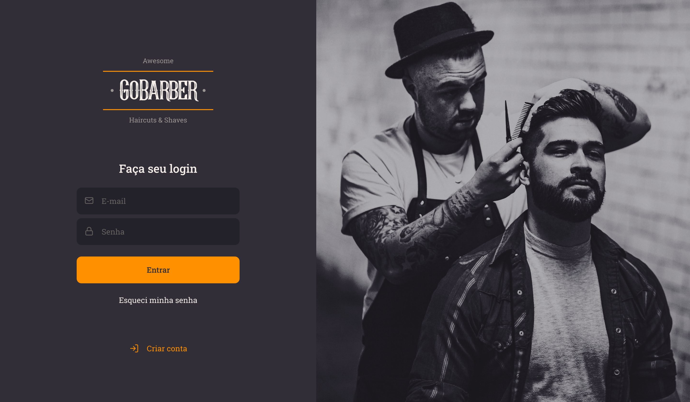

<h4 align="center">
     
    <b>Go Barber - Gestor de Barbearias 2020! by Brenno 😍</b>
</h4>

  
  

 

# Go Barber 2020

## Projeto desenvolvido durante o curso goStack

Esse projeto faz parte do conteúdo estudado no bootcamp goStack da Rocketseat.

Autor: Brenno C. Lins

### Tecnologias usadas

Este projeto foi desenvolvido com as seguintes tecnologias:

- [Typescript](https://www.typescriptlang.org/)
- [JavaScript](https://developer.mozilla.org/pt-BR/docs/Web/JavaScript)
- [NodeJS](https://nodejs.org/en/)
- [ReactJS](https://pt-br.reactjs.org/)
- [React Native](https://reactnative.dev/)
- [Typeorm](https://typeorm.io)
- [JWT](https://jwt.io/)
- [PostgreSQL](https://www.postgresql.org/)
- [Docker](https://www.docker.com/)
- [Git](https://git-scm.com/)

### Ferramentas para desenvolvimento de app usadas

- [VSCode](https://code.visualstudio.com/)
- [Insominia](https://insomnia.rest/download/)
- [EditorConfig](https://editorconfig.org/)
- [ESLint](https://eslint.org/)
- [Prettier](https://prettier.io/)
- [npx create-react-app](https://www.docker.com/)

### Bibliotegas Interessantes

- [Leaflet](https://leafletjs.com/)
- [OpenStreetMap](https://www.openstreetmap.org)
- [Mapbox](https://www.mapbox.com/)
- [Knex](http://knexjs.org/)

### GOSTACK BOOTCAMP ROCKETSEAT

Curso <b>GoStack Bootcamp</b> na [Rocketseat](https://rocketseat.com.br/)

